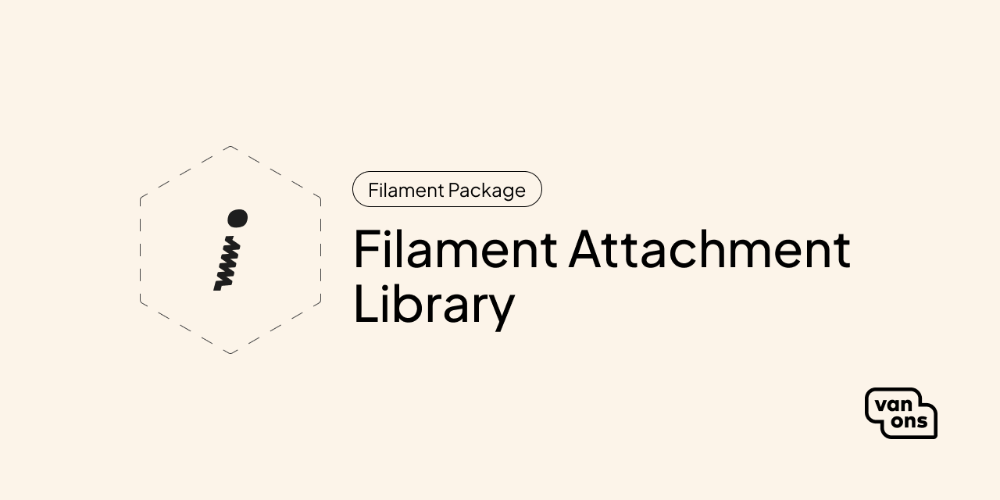

<p align="center" class="filament-hidden"></p>

# Filament Attachment Library

[](https://github.com/VanOns/filament-attachment-library/releases)
[](https://packagist.org/packages/van-ons/filament-attachment-library)
[](https://github.com/VanOns/filament-attachment-library/issues)
[](https://github.com/VanOns/filament-attachment-library/blob/main/LICENSE.md)

Filament package for easy attachment uploading and browsing.

## Quick start

> For Filament version compatibility, see [Compatibility](docs/compatibility.md).

### Installation

The Filament Attachment Library can be installed using Composer by running
the following command:

```bash
composer require van-ons/filament-attachment-library:^2.0
```

An installation command is available that ensures that the migrations and
assets are installed:

```bash
php artisan filament-attachment-library:install
```

The templates in this package use TailwindCSS. To ensure the styling is rendered correctly, a custom Filament
theme must be set up, and the `tailwind.config.js` file should be extended.

Create the custom Filament theme and follow the instructions in the terminal to set it up:

```bash
php artisan make:filament-theme [PANEL_NAME]
```

Add the following to the generated `theme.css` file:

```css
// resources/css/filament/[PANEL_NAME]/theme.css
@source '../../../../vendor/van-ons/filament-attachment-library/resources/**/*.blade.php'
```

> [!NOTE]
> Make sure to follow the instructions in the terminal to register your custom Filament theme in the admin panel.
> 
> If your project is using Vite, you may have to register the custom theme as follows:
> `->viteTheme('resources/css/filament/[PANEL_NAME]/theme.css', 'build')`

By default, this package uses the `public` disk defined in `filesystems.php`. This can be overridden by adding the following
to the project's `.env` file:

```env
ATTACHMENTS_DISK=disk_name_here
```

> [!NOTE]
> It is advised to use a disk without any other files. This prevents file conflicts.

The `glide.php` and `attachment-library.php` files contain more configuration options.

#### Prepare model

Register the plugin in the desired Filament panel:

```php
namespace App\Providers\Filament;

use VanOns\FilamentAttachmentLibrary\FilamentAttachmentLibrary;

class ExamplePanelProvider extends PanelProvider
{
    public function panel(Panel $panel): Panel
    {
        return $panel
            ->plugin(
                FilamentAttachmentLibrary::make()->navigationGroup('Files')
            );
    }

}
```

### Usage

The attachment field can be used in two ways: either to store the attachments in a specific column of your model,
or to store the attachments in the `attachments` relationship by using the `HasAttachments` trait and the `relationship()` method.

(Optional) Add the `HasAttachments` trait to your desired model:

```php
namespace App\Models;

use Illuminate\Database\Eloquent\Model;
use VanOns\LaravelAttachmentLibrary\Concerns\HasAttachments;

class ModelName extends Model
{
    use HasAttachments;

    // ...
}
```

This will add the `attachments()` relationship which links one or more
attachments to your model.

Then, in your form schema, add the `AttachmentField`:

```php
namespace App\Filament\Resources;

use Filament\Forms;
use Filament\Forms\Form;
use VanOns\FilamentAttachmentLibrary\Forms\Components\AttachmentField;

public static function form(Form $form): Form
{
    return $form
        ->schema([
            // ...
            // If you want to store the attachments in a column
            AttachmentField::make('featured_image'),
            // Or if you want to store attachments in the attachments relationship with a specific collection name
            AttachmentField::make('gallery')->relationship(),
            // Or if you want the collection name to be different from the field name
            AttachmentField::make('gallery')->relationship()->collection('product_gallery'),
        ]);
}
```

(Optional) When using the `relationship()` method, you can filter the attachments by collection name. To make this easier you can add a separate relationship method to your model:

```php
namespace App\Models;

use Illuminate\Database\Eloquent\Model;
use Illuminate\Database\Eloquent\Relations\MorphToMany;
use VanOns\LaravelAttachmentLibrary\Concerns\HasAttachments;

class ModelName extends Model
{
    use HasAttachments;

    public function gallery(): MorphToMany
    {
        return $this->attachmentCollection('gallery');
    }
}
```

Finally, at the front end, the `laravel-attachment-library-image` Blade component can be used to display attachments as image. 
Glide is used to scale the image up or down. The `src` argument may be an Attachment instance, or the id as string/integer.

```html
<x-laravel-attachment-library-image :src="$image" />
```

For more information refer to the [Laravel Attachment Library documentation](https://github.com/VanOns/laravel-attachment-library).

## Documentation

Please see the [documentation](docs/README.md#contents) for detailed information about installation and usage.

## Contributing

Please see [Contributing](CONTRIBUTING.md) for more information about how you can contribute.

### JavaScript assets

The package's Alpine components live in `resources/js/plugin.js` and are bundled into the committed
`resources/dist/filament-attachment-library.js` artifact. After changing any JS, rebuild and commit the artifact:

```bash
npm install
npm run build
```

Consuming applications republish the bundle automatically on composer updates through Filament's standard
`filament:upgrade` composer hook; apps without that hook must run `php artisan filament:assets` manually.

## Changelog

Please see [Changelog](CHANGELOG.md) for more information about what has changed recently.

## Upgrading

Please see [Upgrading](UPGRADING.md) for more information about how to upgrade.

## Security

Please see [Security](SECURITY.md) for more information about how we deal with security.

## Credits

We would like to thank the following contributors for their contributions to this project:

- [All contributors](../../contributors)

## License

The scripts and documentation in this project are released under the [MIT License](LICENSE.md).

---

<p align="center"><a href="https://van-ons.nl/" target="_blank"></a></p>
