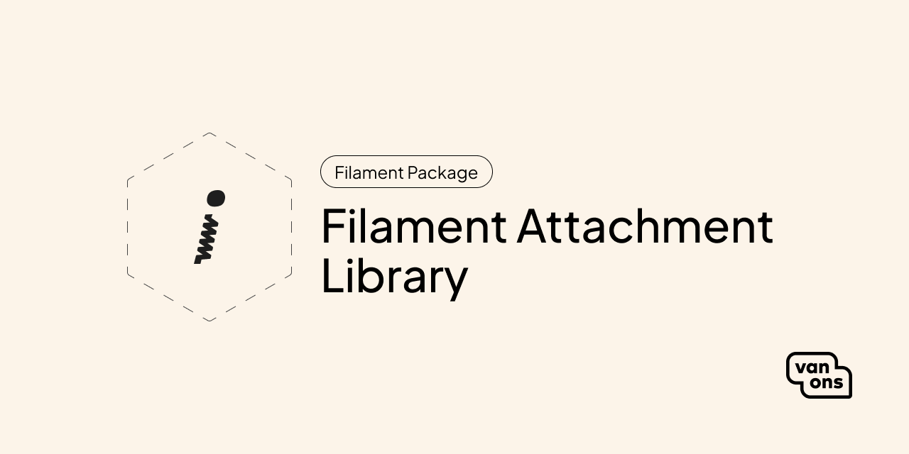

<p align="center"></p>

# Filament attachment library

<!-- BADGES -->

Filament package for easy attachment uploading and browsing.

## Quick start

### Installation

The Filament Attachment Library can be installed using composer by running the following command:

```bash
$ composer require van-ons/filament-attachment-library
```

An installation command is available that ensures that the migrations and assets are installed:

```bash
$ php artisan filament-attachment-library:install
```

The templates in this package use TailwindCSS. To ensure that the styling is rendered correctly, the `tailwind.config.js` file should be extended with the following:

```javascript
// tailwind.config.js
export default {
    presets: '',
    content: [
        // ...
        './vendor/van-ons/filament-attachment-library/resources/**/*.blade.php',
    ],
}
```

Then, register the plugin in the desired Filament panel:

```php
<?php

namespace App\Providers\Filament;

use VanOns\FilamentAttachmentLibrary\FilamentAttachmentLibrary;

class ExamplePanelProvider extends PanelProvider
{
    public function panel(Panel $panel): Panel
    {
        return $panel
            ->plugin(FilamentAttachmentLibrary::make());
    }

}
```

By default, this package uses the `public` disk defined in `filesystems.php`. This can be overridden by adding the following to the project's `.env` file:

```env
ATTACHMENTS_DISK=disk_name_here
```

You may need to run `php artisan storage:link` to be able to preview attachments. See [the Laravel documentation](https://laravel.com/docs/11.x/filesystem) for more information.

#### Install Glide

This package depends on the [ampedweb/laravel-glide-in-a-box](https://github.com/ampedweb/laravel-glide-in-a-box) package for handling image manipulation.

Run the command below to publish the configuration file.
```env
$ php artisan vendor:publish --tag=glideinabox
```

Make sure that the `source` matches the disk of the attachments.
```php
// baceinabox.php
<?php

return [
    // ...
    'source' => storage_path('app/media'),
];

```

### Usage

In your form schema, add the AttachmentField:

```php
use Filament\Forms;
use Filament\Forms\Form;
use VanOns\FilamentAttachmentLibrary\Forms\Components\AttachmentField;
 
public static function form(Form $form): Form
{
    return $form
        ->schema([
            // ...
            AttachmentField::make('attachment'),
        ]);
}
```

## Documentation

Please see the [documentation] for detailed information about installation and usage.

## Contributing

Please see [contributing] for more information about how you can contribute.

## Changelog

Please see [changelog] for more information about what has changed recently.

## Upgrading

Please see [upgrading] for more information about how to upgrade.

## Security

Please see [security] for more information about how we deal with security.

## Credits

We would like to thank the following contributors for their contributions to this project:

* [All Contributors][all-contributors]

## License

The scripts and documentation in this project are released under the [MIT License][license].

---

<p align="center"><a href="https://van-ons.nl/" target="_blank"></a></p>

[documentation]: docs
[contributing]: CONTRIBUTING.md
[changelog]: CHANGELOG.md
[upgrading]: UPGRADING.md
[security]: SECURITY.md
[email]: mailto:opensource@van-ons.nl
[all-contributors]: ../../contributors
[license]: LICENSE.md
